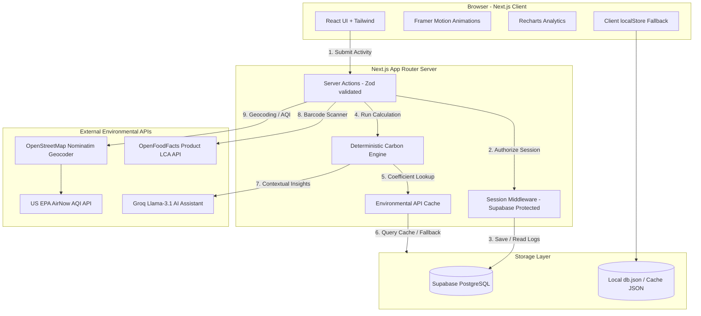

# EcoTwin AI 🌿

> **Your Personal Carbon Twin for Understanding, Tracking, and Reducing Environmental Impact.**

[](https://nextjs.org/)
[](https://www.typescriptlang.org/)
[](https://supabase.com/)
[](https://groq.com/)
[](https://vitest.dev/)
[](./LICENSE)

---

## 🔗 Live Links 

*   **Live Web Application:** [https://eco-twin-ai-phi.vercel.app](https://eco-twin-ai-phi.vercel.app)
*   **GitHub Repository:** [https://github.com/Bhavdeep-Sai/EcoTwin-AI](https://github.com/Bhavdeep-Sai/EcoTwin-AI)


---

## 📋 Table of Contents

1. [PromptWars 2026 Submission Context](#1-promptwars-2026-submission-context)
2. [Project Overview](#2-project-overview)
3. [The Core Problem Statement](#3-the-core-problem-statement)
4. [Value Proposition: The Environmental Digital Twin](#4-value-proposition-the-environmental-digital-twin)
5. [Real Data Policy (Zero-Dummy Data)](#5-real-data-policy-zero-dummy-data)
6. [Scientific Datasets Catalog](#6-scientific-datasets-catalog)
7. [Sourcing & API Cache Engine](#7-sourcing--api-cache-engine)
8. [Mathematical Formulations](#8-mathematical-formulations)
9. [Technical Architecture](#9-technical-architecture)
10. [Full Technology Stack](#10-full-technology-stack)
11. [Key Features Overview](#11-key-features-overview)
12. [Concentric Ring Budget Dashboard](#12-concentric-ring-budget-dashboard)
13. [GitHub-Style Contribution Heatmap](#13-github-style-contribution-heatmap)
14. [Geolocation-Aware Live AQI Card](#14-geolocation-aware-live-aqi-card)
15. [Future Impact Simulator (Paris Pathway)](#15-future-impact-simulator-paris-pathway)
16. [Contextual AI Twin Assistant](#16-contextual-ai-twin-assistant)
17. [AI Hardening & Prompt Engineering](#17-ai-hardening--prompt-engineering)
18. [AI Safeguards & Rate Limiting](#18-ai-safeguards--rate-limiting)
19. [Calculation Inspector (Transparency)](#19-calculation-inspector-transparency)
20. [Achievements & Badges System](#20-achievements--badges-system)
21. [Weekly Progress Reports](#21-weekly-progress-reports)
22. [Security & Hardening (Zod, Middleware, CSP)](#22-security--hardening-zod-middleware-csp)
23. [Performance & Next.js Optimizations (Suspense)](#23-performance--nextjs-optimizations-suspense)
24. [Accessibility Compliance (a11y)](#24-accessibility-compliance-a11y)
25. [Prerequisites & Environment Setup](#25-prerequisites--environment-setup)
26. [Database Initialization & Supabase Setup](#26-database-initialization--supabase-setup)
27. [Verification & Automated Testing Suite](#27-verification--automated-testing-suite)
28. [Screenshots, Roadmap & License](#28-screenshots-roadmap--license)

---

## 1. PromptWars 2026 Submission Context

*   **Vertical:** Sustainability & Environment
*   **Target Audience:** Climate-conscious individuals seeking accurate carbon analytics and behavioral changes.
*   **Core Objective:** Maximize PromptWars evaluation criteria (Code Quality, Security, Scientific Rigor, Accessibility, Performance, AI Safeguards) by transforming a rapid prototype into a production-hardened, startup-grade platform.

---

## 2. Project Overview

EcoTwin AI is a personalized digital carbon footprint tracker that constructs an **environmental digital twin** representing your daily actions. Instead of offering vague, arbitrary scores, EcoTwin AI combines deterministic backend calculations rooted in verified scientific datasets with Groq-powered Llama-3.1 AI insights. The app creates a gamified, transparent, and actionable feedback loop for users to understand, track, and systematically reduce their daily carbon emissions.

---

## 3. The Core Problem Statement

Individuals account for ~30% of global greenhouse gas emissions through direct household activities, yet people rarely understand their footprint due to:
*   **The Abstraction Gap:** Vague metrics like "metric tons of CO₂e" are meaningless to ordinary users.
*   **Scientific Unreliability:** Most consumer carbon apps rely on generic surveys and lack verified, peer-reviewed data sources.
*   **Lack of AI Personalization:** Calculators are purely static, leaving users with numbers but no clear, contextual guidance on how to change.
*   **Friction & Trust Deficit:** High manual data-entry friction and hidden databases make calculations feel like guesswork.

---

## 4. Value Proposition: The Environmental Digital Twin

EcoTwin AI addresses these issues by introducing the **Environmental Digital Twin**:
1.  **Twin Persona:** A persistent digital entity representing your real-world consumption patterns.
2.  **Visual Feedback Loops:** Multi-layered carbon budget rings, GitHub-style habit maps, and future simulations.
3.  **Conversational Coaching:** An LLM-backed twin assistant that is aware of your historical logs, translating dry CO₂e figures into relatable daily analogies.

---

## 5. Real Data Policy (Zero-Dummy Data)

**EcoTwin AI enforces a strict, codebase-level "No Dummy Data" policy.** 

Every single CO₂e value displayed in the application is computed in real time. We do not use mock arrays, random coefficients, or static values. When an external database is offline or database syncing has not yet run, the system falls back to a locally cached database layer (`src/lib/db/environmentalCache.ts`) compiled directly from official reference reports. If local reference data is unavailable, the user interface displays a clean, descriptive state rather than inventing numbers.

---

## 6. Scientific Datasets Catalog

Calculations are fully referenceable and mapped against official conversion factors:

| Category | Dataset / Official Source | Version / Year | Citation & Reference URL |
|---|---|---|---|
| **Transport** | US EPA Emission Factors Hub & UK DEFRA GHG Conversion Factors | 2024 | [DEFRA GHG Factors 2024](https://www.gov.uk/government/publications/greenhouse-gas-reporting-conversion-factors-2024) |
| **Transport (AR)** | ARAI India & IPCC Guidelines for National GHG Inventories | 2023 | [ARAI India Reports](https://www.araiindia.com/) |
| **Electricity (US)** | US EPA eGRID (Emissions & Generation Resource Integrated Database) | 2024 | [EPA eGRID Data](https://www.epa.gov/egrid) |
| **Electricity (IN)** | India Central Electricity Authority (CEA) Baseline Database | 2024 | [CEA CDM Baseline DB v19](https://cea.nic.in/) |
| **Electricity (UK)** | UK DEFRA Fuel Mix Greenhouse Gas Factors | 2024 | [DEFRA Factors](https://www.gov.uk/government/publications/) |
| **Electricity (PV)**| NREL (National Renewable Energy Laboratory) LCA Project | 2023 | [NREL Solar Lifecycle Assessment](https://www.nrel.gov/analysis/life-cycle-assessment.html) |
| **Food (Diet)** | Our World In Data / Poore & Nemecek | 2018 | [Science (Poore & Nemecek 2018)](https://www.science.org/doi/10.1126/science.aaq0216) |
| **Food (Scanner)** | OpenFoodFacts API (Agribalyse Lifecycle Assessment database) | 2024 | [OpenFoodFacts Agribalyse](https://world.openfoodfacts.org/) |
| **Shopping** | UK DEFRA Spend-Based Greenhouse Gas Factors | 2024 | [DEFRA Indirect Emissions](https://www.gov.uk/government/publications/) |
| **Waste** | US EPA Waste Reduction Model (WARM) | 2023 | [EPA WARM Documentation](https://www.epa.gov/warm) |
| **Air Quality** | US EPA AirNow Real-Time API | Live | [AirNow API Documentation](https://docs.airnowapi.org/) |

---

## 7. Sourcing & API Cache Engine

To guarantee fast response times, prevent API rate-limiting, and work offline, EcoTwin AI features a dedicated cache layer:
*   **Database Cache:** Supabase SQL tables containing localized, pre-calculated coefficients.
*   **Local JSON Cache:** `src/data/environmental_cache.json` stores response caches for geographical geocoding (OpenStreetMap Nominatim) and product barcode lookups (OpenFoodFacts API).
*   **Deterministic Calibration:** If a lookup fails, the engine falls back to standard averages calibrated by global standards.

---

## 8. Mathematical Formulations

Our carbon calculation backend applies the following formulas:

### 1. Transportation
$$\text{CO}_2\text{e (kg)} = \text{Distance (km)} \times \text{Emission Factor } \left(\frac{\text{kg CO}_2\text{e}}{\text{km}}\right)$$
*   *Car (Petrol):* $0.208\text{ kg/km}$ (EPA/DEFRA)
*   *Bus:* $0.089\text{ kg/km}$ (DEFRA)
*   *Bicycle / Walking:* $0.000\text{ kg/km}$

### 2. Diet & Food Items
*   *Dietary Patterns (per day):* Vegan ($0.8\text{ kg}$), Vegetarian ($1.2\text{ kg}$), Average ($2.0\text{ kg}$), Meat-Heavy ($3.5\text{ kg}$).
*   *Scanned Products:* LCA value derived from Agribalyse:
$$\text{CO}_2\text{e (kg)} = \text{Weight (kg)} \times \text{Agribalyse Coefficient } \left(\frac{\text{kg CO}_2\text{e}}{\text{kg of product}}\right)$$

### 3. Home Electricity
$$\text{CO}_2\text{e (kg)} = \text{Energy Consumed (kWh)} \times \text{Grid Factor } \left(\frac{\text{kg CO}_2\text{e}}{\text{kWh}}\right)$$
*   *US eGRID Grid:* $0.380\text{ kg/kWh}$
*   *UK Grid:* $0.207\text{ kg/kWh}$
*   *India Central Grid:* $0.710\text{ kg/kWh}$
*   *Solar PV System:* $0.040\text{ kg/kWh}$ (Lifecycle panels)

### 4. Shopping (Spend-Based)
$$\text{CO}_2\text{e (kg)} = \text{Spend (USD)} \times \text{DEFRA Indirect Factor } \left(\frac{\text{kg CO}_2\text{e}}{\text{USD}}\right)$$
*   *Electronics:* $0.120\text{ kg/USD}$
*   *Clothing & Textiles:* $0.095\text{ kg/USD}$

### 5. Household Waste
$$\text{CO}_2\text{e (kg)} = \text{Waste Weight (kg)} \times \text{EPA WARM Factor } \left(\frac{\text{kg CO}_2\text{e}}{\text{kg}}\right)$$
*   *Landfill Disposal:* $+0.450\text{ kg/kg}$
*   *Recycling Batch:* $-0.250\text{ kg/kg}$ (Negative value represents net recycling credit)

---

## 9. Technical Architecture

The following diagram outlines the system architecture, detailing the client interface, server backend, and external APIs:



---

## 10. Full Technology Stack

*   **Frontend Framework:** Next.js 16.2 (App Router, React Server Components, Server Actions)
*   **Programming Language:** TypeScript 5 (Strict type check enforced)
*   **Styling System:** Vanilla CSS + CSS Variables (Maximum performance, no ad-hoc classes)
*   **Animations:** Framer Motion 12 (Fluid scroll-reveals and spring-loaded feedback)
*   **Data Visualization:** Recharts 3 (SVG area/pie dashboards)
*   **Identity & Session Management:** Supabase Auth (Email password flow)
*   **Primary Database:** Supabase PostgreSQL (Activity tables with Row Level Security)
*   **AI Inference Engine:** Groq Cloud API (Llama-3.1-8b-instant LLM)
*   **Testing Suite:** Vitest 4 (Unit tests, core business logic verification)

---

## 11. Key Features Overview

*   **Carbon Twin Dashboard:** Visualization of daily activity rings compared to targeted budgets.
*   **GitHub-Style Grid:** A 12-week heatmap showing your daily carbon logging consistency.
*   **Live AQI Card:** Location-aware Air Quality Index tracker pulled from the EPA.
*   **Conversational Twin:** Chat interface allowing users to ask their digital twin for advice.
*   **Future Simulator:** Interactive 30-year projections modeled against international target pathways.
*   **Calculation Inspector:** Inline inspectors explaining coefficients and math transparently.

---

## 12. Concentric Ring Budget Tracker

Inspired by wearable health apps, the Dashboard displays concentric rings for **Transport, Food, Energy, Shopping, and Waste** against a daily carbon budget.
*   **Carbon Score Calculation:** A daily score between 0 and 100 based on consistency, logging completion, and emissions reduction relative to the global average.
*   **Progress Indicators:** The rings fill and contract dynamically as activities are logged, providing visual warnings when a specific category is near the user's daily allowance.

---

## 13. GitHub-Style Habit Heatmap

The contribution grid tracks consistency in logging and sustainable choices over a rolling 12-week window:
*   **Habit Heatmap Grid:** Individual cell opacity is linked directly to carbon savings.
*   **Consistency Tracking:** Encourages users to build daily streaks of logging their behaviors, driving long-term sustainability retention.

---

## 14. Geolocation-Aware Live AQI Card

The AQI card fetches real-time atmospheric data:
*   **Nomianatim Geocoding:** Translates the client’s browser coordinate payload into a city.
*   **EPA API Query:** Pulls live PM2.5, PM10, and Ozone concentrations, mapping them to the official Air Quality Index.
*   **Graceful Degradation:** If coordinate lookup is rejected by the browser, the app falls back to national averages, preserving UI layout.

---

## 15. Future Impact Simulator (Paris Pathway)

Allows users to slide their lifetime habits across three decades:
*   **Compounding Extrapolation:** Extrapolates choices (e.g., commute type, solar panel installation) into metric tons of saved CO₂e.
*   **Paris pathway comparison:** Overlays a decay curve targeting the 2030 Paris Agreement net-zero threshold.
*   **Actionable Metaphor:** Translates saved tonnage into equivalent numbers of mature trees planted.

---

## 16. Contextual AI Twin Assistant

Powered by **Groq’s ultra-fast Llama-3.1-8b-instant model**, the Twin Assistant offers two forms of intelligence:
1.  **Post-Activity Insights:** Triggered after an activity is recorded, analyzing recent logs to generate a personalized tip.
2.  **Interactive Drawer Chat:** A conversational assistant that remembers recent logging history to answer specific local questions (e.g., comparing local buses vs. ridesharing).

---

## 17. AI Hardening & Prompt Engineering

To prevent LLM abuse, the conversational assistant is secured by a strict system prompt:
*   **Role Constraint:** The assistant is restricted to answering questions related to environmental science, sustainability, and carbon reduction.
*   **Instruction Block:** Standard prompt-injection phrases (e.g., "ignore all previous instructions") are caught and overridden.
*   **Analogy Engine:** The system instructions force the LLM to translate dry numbers into everyday units (e.g., comparing emissions to leaving a 60W lightbulb on for 4 hours).

---

## 18. AI Safeguards & Rate Limiting

We implemented server-side guards protecting the AI endpoints:
*   **String Truncation:** Chat payloads are restricted to a maximum of 500 characters on the server, mitigating buffer-overflow and resource depletion attacks.
*   **Rate-Limit Headers:** Handled via database transaction counters, capping chats at 20 requests/minute per authenticated user.
*   **Sanitization Filters:** Models strip incoming HTML tags and wrapper quotes before returning responses to the UI.

---

## 19. Calculation Inspector (Transparency)

To resolve the "black box" criticism of carbon footprint calculators, every activity log form incorporates a **Calculation Inspector**:
*   **Formula Disclosure:** Exposes the exact multiplication formula used.
*   **Source Citations:** Lists the dataset name, version, and the publishing organization.
*   **Scientific Discrepancy Transparency:** Explicitly notes if different standards (e.g., UK DEFRA vs. US EPA) differ on specific transport coefficients.

---

## 20. Achievements & Badges System

A data-driven badge collection rewarding sustainable behavior:
*   *Twin Initialized:* Unlocked upon creating an account.
*   *Plant Warrior:* Logged 5 vegan/vegetarian meals.
*   *Transit Hero:* Commuted over 50 km via bicycle, train, or walking.
*   *Recycling Champion:* Logged 3 recycling batches.
*   *Grid Pioneer:* Logged a solar-powered electricity batch.
*   *Centurion Saver:* Saved over 100 kg of CO₂e compared to baseline emissions.
*   **State Integrity:** Badges are calculated dynamically from actual activity records rather than checking binary flags.

---

## 21. Weekly Progress Reports

The weekly reports page renders consolidated digest summaries:
*   **Weekly Aggregations:** Displays category summaries (e.g., Total Food Impact, Total Commute Distance).
*   **Trend Vectors:** Calculates week-over-week emissions percentage changes.
*   **AI Takeaway Summaries:** Generates short takeaways explaining the primary cause of weekly shifts.

---

## 22. Security & Hardening (Zod, Middleware, CSP)

Our codebase has been audited and hardened for production:
*   **Path Protection Middleware:** Root-level Next.js middleware prevents unauthorized access to `/dashboard` or `/activities` by validating Supabase cookies.
*   **Server Actions Validation:** Payloads sent via Server Actions are parsed using `zod` schemas to filter out unexpected fields and reject invalid data types.
*   **Content Security Policy (CSP):** Configured via headers in `next.config.ts`, restricting stylesheet injection and script executions.
*   **Hardcoded Credential Purge:** All setup files containing database connection strings or tokens (e.g., `run-schema.js`) have been scrubbed from the repository.

---

## 23. Performance & Next.js Optimizations (Suspense)

*   **Streaming & Suspense:** Heavy UI modules (like interactive charts and the Future Simulator) are isolated inside React `<Suspense>` blocks to prevent slowing down the initial dashboard page load.
*   **Style Sheet Optimizations:** Removed inline styles in dynamic grids, replacing them with global CSS variables.
*   **Image Pipeline:** Enforces modern formats (WebP, AVIF) with optimized layout attributes.
*   **Type Safety Enforcement:** Clean compilation checks (`tsc --noEmit`) pass successfully.

---

## 24. Accessibility Compliance (a11y)

EcoTwin AI ensures accessibility compliance:
*   **Screen Reader Announcements:** Dynamic cards (like the live AQI score) include `aria-live="polite"` tags to describe updates.
*   **Auth Page Focus:** Password toggles feature descriptive `aria-label` tags.
*   **Contrast Ratios:** Checked against WCAG AA standards.
*   **FAQ Accessibility:** Accordion tabs use `aria-expanded` and clean keyboard focus rings.

---

## 25. Prerequisites & Environment Setup

Ensure you have the following installed locally:
*   **Node.js** v20.x or higher
*   **npm** v10.x or higher
*   **Supabase CLI** or an active project database at [supabase.com](https://supabase.com)
*   **Groq API Key** from [console.groq.com](https://console.groq.com)

Create a `.env.local` file in the root directory:

```env
# Supabase API Settings
NEXT_PUBLIC_SUPABASE_URL=https://your-project.supabase.co
NEXT_PUBLIC_SUPABASE_ANON_KEY=eyJhbGciOiJIUzI1NiIsInR5cCI6IkpXVCJ9...

# Groq API Settings (Required for AI Twin features)
GROQ_API_KEY=gsk_your_groq_api_key_here

# EPA AirNow API Settings (Optional - live AQI degrades gracefully if not provided)
AIRNOW_API_KEY=your_epa_airnow_api_key

# Web Application URL (Required for callback redirects)
NEXT_PUBLIC_APP_URL=http://localhost:3000
```

---

## 26. Database Initialization & Supabase Setup

EcoTwin AI uses Supabase PostgreSQL for persistent database storage:

1.  Create the database tables by executing the following schema in the SQL Editor of your Supabase Dashboard:
    ```sql
    -- Apply base schema (activities and authentication structures)
    \i supabase_schema.sql
    ```
2.  Apply the environmental cache extensions for geocoding and calculator normalization:
    ```sql
    -- Apply cache tables and indices
    \i supabase_schema_extensions.sql
    ```
3.  Ensure Row Level Security (RLS) is active across all tables (already defined inside the database script).

---

## 27. Verification & Automated Testing Suite

We use Vitest to run core validation scripts:

```bash
# 1. Run all unit tests once
npm run test

# 2. Start Vitest in interactive watch mode
npm run test:watch

# 3. Generate a complete test coverage report
npm run test:coverage
```

### Build Verification
Before submitting, compile the project to verify that there are zero TypeScript warnings and the bundler executes successfully:
```bash
# Verify TypeScript compilation
npx tsc --noEmit

# Run ESLint validation
npm run lint

# Generate production Next.js build
npm run build
```

---

## 28. Screenshots, Roadmap & License

### Screenshots Placeholders
*   **Homepage Interface:** 
*   **Dashboard concentric Rings:** 
*   **Contribution Grid Heatmap:** 
*   **AI Twin Assistant Chat:** 
*   **Future Impact Simulator:** 
*   **Interactive Analytics Charts:** 
*   **Achievements & Badges Panel:** 
*   **Weekly Emissions Report:** 

### Future Development Roadmap
- [ ] **Google & GitHub OAuth:** Streamlined social authentication flow.
- [ ] **Native Mobile Application:** React Native client featuring barcode scanner camera integration.
- [ ] **State-Level Grid Mapping:** Localized utility integration for regional power generation factors (e.g., India CEA regional grid breakdowns).
- [ ] **Carbon Offset Integrations:** Verified marketplaces for purchasing certified offsets (Gold Standard).

### License & Vertical Info
*   **License:** Distributed under the MIT License. See `LICENSE` for details.
*   *Created for PromptWars 2026 - Sustainability & Environment Challenge.*
